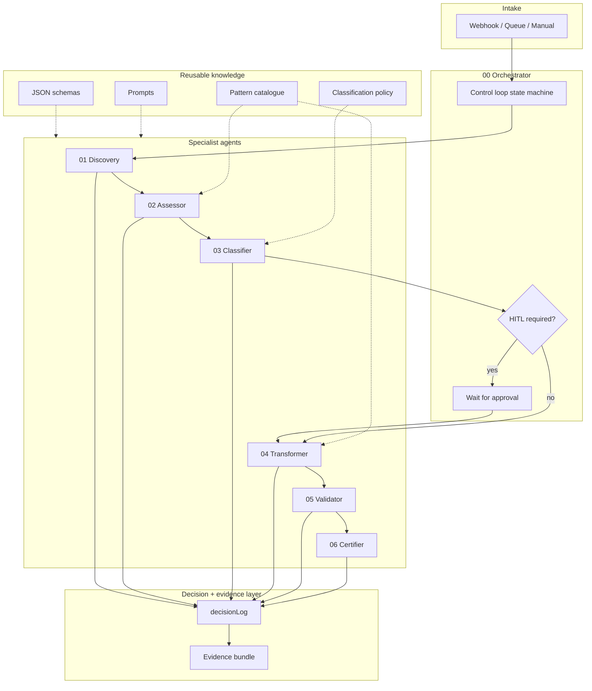

# Agent topology

```mermaid
flowchart TB
  subgraph intake [Intake]
    WH[Webhook / Queue / Manual]
  end

  subgraph orch [00 Orchestrator]
    SM[Control loop state machine]
    HITL{HITL required?}
    WAIT[Wait for approval]
  end

  subgraph agents [Specialist agents]
    D[01 Discovery]
    A[02 Assessor]
    C[03 Classifier]
    T[04 Transformer]
    V[05 Validator]
    Z[06 Certifier]
  end

  subgraph knowledge [Reusable knowledge]
    CAT[Pattern catalogue]
    POL[Classification policy]
    SCH[JSON schemas]
    PR[Prompts]
  end

  subgraph evidence [Decision + evidence layer]
    LOG[decisionLog]
    BUNDLE[Evidence bundle]
  end

  WH --> SM
  SM --> D --> A --> C --> HITL
  HITL -->|yes| WAIT --> T
  HITL -->|no| T
  T --> V --> Z
  CAT -.-> A
  CAT -.-> T
  POL -.-> C
  SCH -.-> agents
  PR -.-> agents
  D & A & C & T & V & Z --> LOG --> BUNDLE
```
